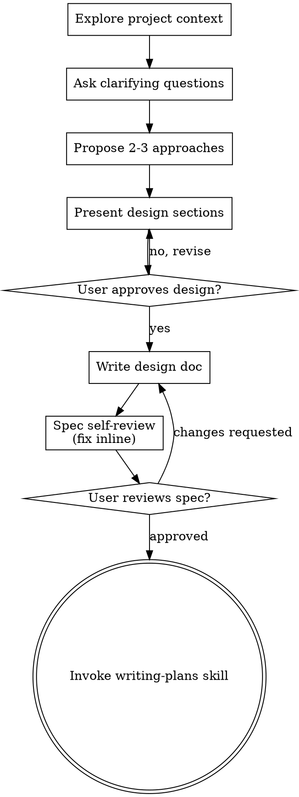

# Thiết kế lại giao diện GitHub clone theo bản gốc

*Exported on 2026-08-16*

---

**User**

*Aug 9, 2026, 19:19*

# Brainstorming Ideas Into Designs

Help turn ideas into fully formed designs and specs through natural collaborative dialogue.

Start by understanding the current project context, then ask questions one at a time to refine the idea. Once you understand what you're building, present the design and get user approval.

<HARD-GATE>
Do NOT invoke any implementation skill, write any code, scaffold any project, or take any implementation action until you have presented a design and the user has approved it. This applies to EVERY project regardless of perceived simplicity.
</HARD-GATE>

## Anti-Pattern: "This Is Too Simple To Need A Design"

Every project goes through this process. A todo list, a single-function utility, a config change — all of them. "Simple" projects are where unexamined assumptions cause the most wasted work. The design can be short (a few sentences for truly simple projects), but you MUST present it and get approval.

## Checklist

You MUST create a task for each of these items and complete them in order:

1. **Explore project context** — check files, docs, recent commits
2. **Offer the visual companion just-in-time** — NOT upfront. The first time a question would genuinely be clearer shown than described, offer it then (its own message); on approval its browser tab opens for you. If no visual question ever arises, never offer it. See the Visual Companion section below.
3. **Ask clarifying questions** — one at a time, understand purpose/constraints/success criteria
4. **Propose 2-3 approaches** — with trade-offs and your recommendation
5. **Present design** — in sections scaled to their complexity, get user approval after each section
6. **Write design doc** — save to `docs/superpowers/specs/YYYY-MM-DD-<topic>-design.md` and commit
7. **Spec self-review** — quick inline check for placeholders, contradictions, ambiguity, scope (see below)
8. **User reviews written spec** — ask user to review the spec file before proceeding
9. **Transition to implementation** — invoke writing-plans skill to create implementation plan

## Process Flow



**The terminal state is invoking writing-plans.** Do NOT invoke frontend-design, mcp-builder, or any other implementation skill. The ONLY skill you invoke after brainstorming is writing-plans.

## The Process

**Understanding the idea:**

- Check out the current project state first (files, docs, recent commits)
- Before asking detailed questions, assess scope: if the request describes multiple independent subsystems (e.g., "build a platform with chat, file storage, billing, and analytics"), flag this immediately. Don't spend questions refining details of a project that needs to be decomposed first.
- If the project is too large for a single spec, help the user decompose into sub-projects: what are the independent pieces, how do they relate, what order should they be built? Then brainstorm the first sub-project through the normal design flow. Each sub-project gets its own spec → plan → implementation cycle.
- For appropriately-scoped projects, ask questions one at a time to refine the idea
- Prefer multiple choice questions when possible, but open-ended is fine too
- Only one question per message - if a topic needs more exploration, break it into multiple questions
- Focus on understanding: purpose, constraints, success criteria

**Exploring approaches:**

- Propose 2-3 different approaches with trade-offs
- Present options conversationally with your recommendation and reasoning
- Lead with your recommended option and explain why

**Presenting the design:**

- Once you believe you understand what you're building, present the design
- Scale each section to its complexity: a few sentences if straightforward, up to 200-300 words if nuanced
- Ask after each section whether it looks right so far
- Cover: architecture, components, data flow, error handling, testing
- Be ready to go back and clarify if something doesn't make sense

**Design for isolation and clarity:**

- Break the system into smaller units that each have one clear purpose, communicate through well-defined interfaces, and can be understood and tested independently
- For each unit, you should be able to answer: what does it do, how do you use it, and what does it depend on?
- Can someone understand what a unit does without reading its internals? Can you change the internals without breaking consumers? If not, the boundaries need work.
- Smaller, well-bounded units are also easier for you to work with - you reason better about code you can hold in context at once, and your edits are more reliable when files are focused. When a file grows large, that's often a signal that it's doing too much.

**Working in existing codebases:**

- Explore the current structure before proposing changes. Follow existing patterns.
- Where existing code has problems that affect the work (e.g., a file that's grown too large, unclear boundaries, tangled responsibilities), include targeted improvements as part of the design - the way a good developer improves code they're working in.
- Don't propose unrelated refactoring. Stay focused on what serves the current goal.

## After the Design

**Documentation:**

- Write the validated design (spec) to `docs/superpowers/specs/YYYY-MM-DD-<topic>-design.md`
  - (User preferences for spec location override this default)
- Use elements-of-style:writing-clearly-and-concisely skill if available
- Commit the design document to git

**Spec Self-Review:**
After writing the spec document, look at it with fresh eyes:

1. **Placeholder scan:** Any "TBD", "TODO", incomplete sections, or vague requirements? Fix them.
2. **Internal consistency:** Do any sections contradict each other? Does the architecture match the feature descriptions?
3. **Scope check:** Is this focused enough for a single implementation plan, or does it need decomposition?
4. **Ambiguity check:** Could any requirement be interpreted two different ways? If so, pick one and make it explicit.

Fix any issues inline. No need to re-review — just fix and move on.

**User Review Gate:**
After the spec review loop passes, ask the user to review the written spec before proceeding:

> "Spec written and committed to `<path>`. Please review it and let me know if you want to make any changes before we start writing out the implementation plan."

Wait for the user's response. If they request changes, make them and re-run the spec review loop. Only proceed once the user approves.

**Implementation:**

- Invoke the writing-plans skill to create a detailed implementation plan
- Do NOT invoke any other skill. writing-plans is the next step.

## Key Principles

- **One question at a time** - Don't overwhelm with multiple questions
- **Multiple choice preferred** - Easier to answer than open-ended when possible
- **YAGNI ruthlessly** - Remove unnecessary features from all designs
- **Explore alternatives** - Always propose 2-3 approaches before settling
- **Incremental validation** - Present design, get approval before moving on
- **Be flexible** - Go back and clarify when something doesn't make sense

## Visual Companion

A browser-based companion for showing mockups, diagrams, and visual options during brainstorming. Available as a tool — not a mode. Accepting the companion means it's available for questions that benefit from visual treatment; it does NOT mean every question goes through the browser.

**Offering the companion (just-in-time):** Do NOT offer it upfront. Wait until a question would genuinely be clearer shown than told — a real mockup / layout / diagram question, not merely a UI *topic*. The first time that happens, offer it then, as its own message:
> "This next part might be easier if I show you — I can put together mockups, diagrams, and comparisons in a browser tab as we go. It's still new and can be token-intensive. Want me to? I'll open it for you."

**This offer MUST be its own message.** Only the offer — no clarifying question, summary, or other content. Wait for the user's response. If they accept, start the server with `--open` so their browser opens to the first screen automatically. If they decline, continue text-only and don't offer again unless they raise it.

**Per-question decision:** Even after the user accepts, decide FOR EACH QUESTION whether to use the browser or the terminal. The test: **would the user understand this better by seeing it than reading it?**

- **Use the browser** for content that IS visual — mockups, wireframes, layout comparisons, architecture diagrams, side-by-side visual designs
- **Use the terminal** for content that is text — requirements questions, conceptual choices, tradeoff lists, A/B/C/D text options, scope decisions

A question about a UI topic is not automatically a visual question. "What does personality mean in this context?" is a conceptual question — use the terminal. "Which wizard layout works better?" is a visual question — use the browser.

If they agree to the companion, read the detailed guide before proceeding:
`skills/brainstorming/visual-companion.md`


Base directory for this skill: C:\Users\trmin\.config\opencode\node_modules\superpowers\skills\brainstorming
Relative paths in this skill (e.g., scripts/, references/) are relative to this base directory.

hiện tại bản clone lại của github đang chưa giống giao diện bản gốc lắm. Tôi vẽ Blocklayout phần header có vẽ 2 block bên trong gồm block của site-header và sub-nav nên là nó phải nằm cùng nhau tại 1 block header giống như bản gốc [image-1.png] [image-2.png] [image-3.png] phần footer bản clone đang bị xa nhau quá mà bản gốc là nằm ở giữa gần nhau có gap.Tiếp theo là phần [image-4.png] trong bản vẽ của tôi nó là .sidebar-info. Nhưng giờ tôi muốn sửa tên nó là .right-info,right-info__heading,right-info__description,right-info__heading,right-infor__meta và setup giao diện giống bản giống, bản clone chỉ có 1 cái block ngắn gọn như này [image-5.png]. Tiếp theo là về "E:\SET-2026\Block-Github\block-layout-group_1\design\v1\drawio" thì tôi đã chỉnh bản vẽ + drawio lên v2 rồi thì push cái v2 này chung với cái nhánh này luôn không xài v1 nữa để tránh conflicts.

---

**Assistant**

*Aug 9, 2026, 19:20 (openai/gpt-5.6-sol)*

Using brainstorming to inspect the current clone and turn the requested layout corrections into an approved, conflict-safe design before implementation.

---

**Assistant**

*Aug 9, 2026, 19:21 (openai/gpt-5.6-sol)*

The current DOM confirms the structural mismatch: `.sub-nav` is outside `<header class="header">`; the footer uses `space-between`; and the aside is still the compact `.sidebar-info` card. The external file named `Blocklayout-BEM-Github(v2).drawio` is not tracked by this branch and its XML still contains `.sidebar-info`, so the v2 source and the requested class contract need to be reconciled before planning the copy into this repository.

---

**Assistant**

*Aug 9, 2026, 19:28 (openai/gpt-5.6-sol)*

**Các hướng tiếp cận**
1. **Chỉnh có mục tiêu trên cấu trúc hiện tại (khuyến nghị):** lồng `.sub-nav` vào `.header`, thay `.sidebar-info` bằng `.right-info`, bổ sung nội dung/footer, rồi chuyển toàn bộ token màu sang dark theme. Giữ nguyên các block còn lại và responsive hiện có. Diff nhỏ nhất nhưng vẫn đáp ứng đầy đủ.
2. **Dựng lại DOM theo GitHub gốc:** cho độ tương đồng cao hơn nhưng sẽ thay đổi nhiều block đã vẽ, tăng nguy cơ lệch bài Block Layout/BEM.
3. **Chủ yếu sửa CSS:** ít thay đổi nhất nhưng không thể sửa đúng semantic header, nội dung `.right-info`, class contract và footer links.

Tôi đề xuất **hướng 1**. Bản vẽ sẽ được đồng bộ class mới, chuyển vào `design/v2/`, xóa `design/v1/`, đồng thời cập nhật các tài liệu đang coi v1 và `.sidebar-info` là nguồn chuẩn.

Bạn chọn hướng 1 chứ?

---

**User**

*Aug 9, 2026, 19:30*

chọn hướng 1 nha

---

**Assistant**

*Aug 9, 2026, 19:30 (9router/ds/deepseek-v4-flash)*

Đã chốt hướng 1. Kiểm tra phần chi tiết `.sidebar-info` và footer trong bản vẽ v2 trước khi trình bày thiết kế.

---

**Assistant**

*Aug 9, 2026, 19:30 (9router/ds/deepseek-v4-flash)*

Đủ ngữ cảnh để trình bày thiết kế. Bản vẽ v2 có đủ PNG export và bên desktop `.sidebar-info` gồm đúng heading/description/heading/meta — khớp với danh sách class bạn yêu cầu.

## Thiết kế đề xuất (hướng 1)

**1. Header: gộp `.sub-nav` vào `.header`**
- Chuyển `<nav class="sub-nav">` vào trong `<header class="header">`, ngay sau `.site-header`. Giống bản gốc và giống bản vẽ v2 (`.header` chứa 2 block con).
- Không đổi class nào; `.site-header` nền tối, `.sub-nav` trắng + viền dưới như hiện tại. Mobile vẫn dùng `details/summary`.

**2. Block `.right-info` thay `.sidebar-info`**
- Đổi tên class theo đúng hợp đồng: `sidebar-info` → `right-info`, `sidebar-info_people` → `right-info_people`, `sidebar-info__heading` → `right-info__heading`, `sidebar-info__description` → `right-info__description`, `sidebar-info__meta` → `right-info__meta`.
- Bỏ card (nền/viền/padding), chuyển thành cột phải phẳng như GitHub gốc với:
  - **People**: icon người, heading, description, meta (số người đóng góp)
  - đường phân cách
  - **Top languages**: heading + 4 dòng ngôn ngữ (chấm màu + tên)
  - liên kết **Report abuse**
- Thêm 3 element BEM mới cho phần ngôn ngữ/report: `right-info__langs`, `right-info__lang`, `right-info__report` (sẽ phản ánh vào cả bản vẽ v2 để đồng bộ nguồn).

**3. Footer: căn giữa + bổ sung link**
- `.site-footer` bỏ `space-between`, chuyển sang `justify-content: center` với `gap` gọn, đưa logo + copyright + links vào giữa.
- Bổ sung link gốc: `Community`, `Docs`, `Contact`, `Manage cookies`, `Do not share my personal information` (bên cạnh `Terms`, `Privacy`, `Security`, `Status`, `Help`).

**4. Dark theme**
- Đổi toàn bộ token `:root` sang dark theme theo GitHub: nền tối, surface tối, chữ sáng, viền tối; giữ focus-visible và contrast hợp lý.

**5. Bản vẽ v2 + tài liệu**
- Sửa `Blocklayout-BEM-Github(v2).drawio` + PNG: đổi nhãn `.sidebar-info*` → `.right-info*`, thêm 3 element ngôn ngữ/report, và (theo bản vẽ) sửa cấu trúc header cho đúng.
- Copy cả `.drawio` và `.png` vào `design/v2/drawio/`, **xóa** toàn bộ `design/v1/` trên nhánh này.
- Cập nhật `README.md`, `docs/block-list.md`, spec và plan đang tham chiếu v1/`.sidebar-info` sang v2/`.right-info`.

**6. Verification**
- Mở `src/index.html`, kiểm tra header gộp, right-info, footer giữa, dark theme tại 1200/768/767/375px; `git diff --check`; không có tài nguyên ngoài.

Có một chi tiết cần bạn chốt trước khi tôi viết spec: **4 dòng ngôn ngữ và link Report abuse có dùng thêm element BEM như tôi nêu (`right-info__langs`, `right-info__lang`, `right-info__report`) không, hay bạn muốn giữ class set đúng bằng bản vẽ v2 hiện tại và chỉ tái dùng `__heading`/`__meta`?**

---

**Assistant**

*Aug 9, 2026, 19:31 (9router/ds/deepseek-v4-flash)*

Chốt: class set giữ đúng bản vẽ — dòng ngôn ngữ dùng `right-info__meta`, link Report abuse style bằng element selector `.right-info a`.

## Thiết kế cuối cùng

**1. Header** — `<nav class="sub-nav">` vào trong `<header class="header">` sau `.site-header`. Không đổi class.

**2. `.right-info`** — đổi tên 5 class (block + `_people` + `__heading` ×2 + `__description` + `__meta`), bỏ card, nội dung:
- **People**: icon + `__heading` + `__description` + `__meta` (số người)
- phân cách
- **Top languages**: `__heading` + 4 dòng `<li class="right-info__meta">` (chấm màu + tên)
- `<a>` Report abuse (style `.right-info a`)

**3. Footer** — căn giữa, `gap`, bổ sung `Community`, `Docs`, `Contact`, `Manage cookies`, `Do not share my personal information`.

**4. Dark theme** — toàn bộ token `:root` chuyển dark theo GitHub.

**5. Bản vẽ + tài liệu** — sửa file v2 (`.drawio` + `.png`) đổi nhãn `.sidebar-info*` → `.right-info*` và cấu trúc header; copy vào `design/v2/drawio/`; xóa `design/v1/`; cập nhật `README.md`, `docs/block-list.md`, spec + plan.

**6. Verification** — mở `src/index.html` kiểm tra ở 1200/768/767/375px, `git diff --check`, không tài nguyên ngoài.

Xác nhận thiết kế này để tôi viết spec và commit chứ?

---

**User**

*Aug 9, 2026, 19:32*

xác nhận nha

---

**Assistant**

*Aug 9, 2026, 19:32 (9router/ds/deepseek-v4-flash)*

Đã chốt. Viết spec và commit.

---

**Assistant**

*Aug 9, 2026, 19:32 (9router/ds/deepseek-v4-flash)*

Spec self-review: không có placeholder; đối chiếu bản vẽ v2 thì `.header` đã bao gồm `.site-header` + `.sub-nav` (region y=300–670), nên không cần sửa cấu trúc header trong drawio — chỉ đổi nhãn class. Sửa câu đang mơ hồ cho dứt khoát.

---

**Assistant**

*Aug 9, 2026, 19:33 (9router/ds/deepseek-v4-flash)*

Spec đã viết và commit tại `docs/superpowers/specs/2026-08-09-github-libraries-layout-v2-design.md`. Bạn xem lại spec, cần sửa gì trước khi tôi sang bước viết implementation plan không?

---

**User**

*Aug 9, 2026, 19:34*

okk thực thi đi tôi duyệt.

---

**Assistant**

*Aug 9, 2026, 19:34 (9router/ds/deepseek-v4-flash)*

Dùng writing-plans để viết implementation plan.

---

**Assistant**

*Aug 9, 2026, 19:36 (9router/ds/deepseek-v4-flash)*

Tự review plan: phát hiện rule `.right-info__meta` trùng (vừa sửa nhóm selector vừa định nghĩa lại). Sửa để tránh duplicate.

---

**Assistant**

*Aug 9, 2026, 19:36 (9router/ds/deepseek-v4-flash)*

Plan đã commit. Đã duyệt spec trước đó rồi, giờ chọn chế độ thực thi:

---

**Assistant**

*Aug 9, 2026, 19:36 (9router/ds/deepseek-v4-flash)*

Dùng executing-plans để thực thi inline.

---

**Assistant**

*Aug 9, 2026, 19:36 (9router/ds/deepseek-v4-flash)*

Đang thực thi plan. Branch hiện tại là nhánh làm việc chính, bạn đã duyệt thực thi inline — tiếp tục trên nhánh này.

---

**Assistant**

*Aug 9, 2026, 19:36 (9router/ds/deepseek-v4-flash)*

**Task 1 Step 1**: Đổi nhãn trong drawio gốc.

---

**Assistant**

*Aug 9, 2026, 19:36 (9router/ds/deepseek-v4-flash)*

**Task 1 Step 2-3**: Copy vào `design/v2/drawio/`, xóa `design/v1/`, verify, commit.

---

**Assistant**

*Aug 9, 2026, 19:37 (9router/ds/deepseek-v4-flash)*

Verify OK. Commit Task 1.

---

**Assistant**

*Aug 9, 2026, 19:37 (9router/ds/deepseek-v4-flash)*

**Task 2 Step 1**: Chuyển `.sub-nav` vào trong `.header`.

---

**Assistant**

*Aug 9, 2026, 19:37 (9router/ds/deepseek-v4-flash)*

**Task 2 Step 2**: Thay aside `sidebar-info` bằng `right-info`.

---

**Assistant**

*Aug 9, 2026, 19:37 (9router/ds/deepseek-v4-flash)*

**Task 2 Step 3**: Bổ sung link footer.

---

**Assistant**

*Aug 9, 2026, 19:37 (9router/ds/deepseek-v4-flash)*

**Task 2 Step 4**: Verify + commit.

---

**Assistant**

*Aug 9, 2026, 19:37 (9router/ds/deepseek-v4-flash)*

Verify OK, commit Task 2.

---

**Assistant**

*Aug 9, 2026, 19:37 (9router/ds/deepseek-v4-flash)*

**Task 3 Step 1**: Token dark theme.

---

**Assistant**

*Aug 9, 2026, 19:38 (9router/ds/deepseek-v4-flash)*

**Task 3 Step 2**: Màu cứng trong header/button.

---

**Assistant**

*Aug 9, 2026, 19:38 (9router/ds/deepseek-v4-flash)*

**Task 3 Step 3**: Đổi group selector `__meta` và khối `.sidebar-info*`.

---

**Assistant**

*Aug 9, 2026, 19:38 (9router/ds/deepseek-v4-flash)*

**Task 3 Step 4**: Footer căn giữa.

---

**Assistant**

*Aug 9, 2026, 19:38 (9router/ds/deepseek-v4-flash)*

**Task 3 Step 5**: Cập nhật media queries.

---

**Assistant**

*Aug 9, 2026, 19:38 (9router/ds/deepseek-v4-flash)*

**Task 3 Step 6**: Verify + commit.

---

**Assistant**

*Aug 9, 2026, 19:38 (9router/ds/deepseek-v4-flash)*

Verify OK. Commit Task 3.

---

**Assistant**

*Aug 9, 2026, 19:38 (9router/ds/deepseek-v4-flash)*

**Task 4**: Đọc block-list trước khi sửa.

---

**Assistant**

*Aug 9, 2026, 19:38 (9router/ds/deepseek-v4-flash)*

block-list.md không chứa `sidebar-info` (chỉ là danh sách 8 block đề xuất cũ), nên không có gì để đổi tên — bỏ qua bước đó. Cập nhật README, spec, plan.

---

**Assistant**

*Aug 9, 2026, 19:39 (9router/ds/deepseek-v4-flash)*

**Task 4 Step 4**: Verify + commit.

---

**Assistant**

*Aug 9, 2026, 19:39 (9router/ds/deepseek-v4-flash)*

Thiếu 3 chỗ `sidebar-info` trong phần kiến trúc spec. Sửa toàn bộ.

---

**Assistant**

*Aug 9, 2026, 19:39 (9router/ds/deepseek-v4-flash)*

Verify OK, commit Task 4.

---

**Assistant**

*Aug 9, 2026, 19:40 (9router/ds/deepseek-v4-flash)*

`-Recurse` không hợp lệ cho Select-String — chạy lại đúng cách.

---

**Assistant**

*Aug 9, 2026, 19:40 (9router/ds/deepseek-v4-flash)*

Static checks pass. Xác nhận cấu trúc DOM cuối cùng và anchor `#people`.

---

**Assistant**

*Aug 9, 2026, 19:40 (9router/ds/deepseek-v4-flash)*

Cấu trúc chuẩn. Mở trang trong trình duyệt để bạn kiểm tra trực quan.

---

**Assistant**

*Aug 9, 2026, 19:40 (9router/ds/deepseek-v4-flash)*

Xong cả 5 task, 4 commit mới trên nhánh (ahead 7). Đã mở `src/index.html` trong trình duyệt để bạn kiểm tra.

**Bạn cần xác nhận trực quan:**
1. Header: `.sub-nav` nằm ngay dưới `.site-header` trong cùng vùng tối (index.html:36).
2. Cột phải không còn card: People, phân cách, Top languages (4 chấm màu), Report abuse.
3. Footer căn giữa, gap gọn, đủ link mới; mobile xếp dọc.
4. Dark theme toàn trang, chữ đọc được, focus-visible rõ.
5. Ở 1200/768/767/375px không overflow ngang.

**Đã verify:** không còn `sidebar-info` trong `src/` và tài liệu; drawio v2 (`.drawio` + `.png`) ở `design/v2/drawio/`, `design/v1/` đã xóa; `git diff --check` sạch; chỉ load 2 file cục bộ, không JS.

**Chưa làm:** commit cho bản vẽ tay v2 (thư mục `design/v2/hand/` đang trống) và re-export PNG từ draw.io.app cho khớp nhãn mới (thủ công, không bắt buộc).

Kiểm tra xong thấy ổn chưa? Nếu ổn, bạn có thể push nhánh này lên remote.

---

**User**

*Aug 9, 2026, 19:42*

[image-1.png] [image-2.png] hiện tại thì header vẫn chưa nha với xóa luôn cái skip to main content đi.

---

**Assistant**

*Aug 9, 2026, 19:42 (9router/ds/deepseek-v4-flash)*

Using brainstorming to lock in the exact structural fixes and a clean git approach for the header, footer, sidebar renaming, and drawio version.

---

**Assistant**

*Aug 9, 2026, 19:43 (9router/ds/deepseek-v4-flash)*

Header đang lỗi chỗ nào bạn? Tôi cần rõ điểm cụ thể để sửa đúng — bạn chọn giúp:

---

**Assistant**

*Aug 9, 2026, 19:44 (9router/ds/deepseek-v4-flash)*

Sub-nav tách rời vì nền riêng + viền dưới riêng. Đọc chính xác CSS hiện tại để sửa gọn.

---

**Assistant**

*Aug 9, 2026, 19:44 (9router/ds/deepseek-v4-flash)*

Sửa: bỏ skip link (HTML + CSS), gộp `.sub-nav` vào nền header thành một khối liền.

---

**Assistant**

*Aug 9, 2026, 19:44 (9router/ds/deepseek-v4-flash)*

Verify + commit.

---

**Assistant**

*Aug 9, 2026, 19:45 (9router/ds/deepseek-v4-flash)*

Đã sửa xong:

- **Header**: `.sub-nav` giờ nền trong suốt, cùng nền tối với `.site-header`; viền dưới dời lên `.header` — hai thanh nhập thành một khối header liền (style.css:120, 198).
- **Skip link**: xóa khỏi HTML và CSS.

Đã mở lại `src/index.html` trong trình duyệt. Xem thử header giờ đã liền khối chưa, còn gì chưa khớp nữa không?

---

**User**

*Aug 9, 2026, 19:56*

à còn nữa là phần gần gần .site-header__avatar thì bên trái nó là .site-header__search-bar (x2) nó đang bị sai bị lặp lại nên giữ 1 cái lại cái kế avatar tôi chuyển lại thành .site-header__nav nha và thêm các [image-1.png] icon này vào kế avatar giúp tôi. Plan đọc ảnh thôi nhé rồi tôi giao cho bên khác thực thi [image-2.png] với lại header chưa giống bản gốc lắm bản gốc là [image-3.png] sát trái và sát phải luôn

---

**Assistant**

*Aug 9, 2026, 19:56 (9router/gcli/grok-4.5)*

Chỉ lập plan, không code. Đọc lại header hiện tại và ảnh để chốt plan giao thực thi.

---

**Assistant**

*Aug 9, 2026, 19:56 (9router/gcli/grok-4.5)*

Chỉ lập plan, không code. Ghi plan rõ để bàn giao thực thi.

---

**Assistant**

*Aug 9, 2026, 19:57 (9router/gcli/grok-4.5)*

Plan đã ghi tại:

`docs/superpowers/plans/2026-08-09-site-header-nav-icons.md`

**Tóm tắt cho người thực thi**

1. **HTML** (`src/index.html` · `.site-header`)
   - Bỏ `<label>Search GitHub</label>` → chỉ còn **1** `.site-header__search-bar` (aria-label).
   - Thêm `.site-header__nav` **ngay trước** `.site-header__avatar`.
   - 5 icon SVG inline theo image-1 (trái→phải): Copilot · Create(+) · Issues · PR · Inbox, rồi avatar.

2. **CSS** (`src/css/style.css`)
   - Bỏ `max-width: 1200px` + `margin: 0 auto` trên `.site-header` (và hàng sub-nav nếu cần) → **full-bleed** sát trái/phải như image-3.
   - Search: `flex: 0 1 272px` + `margin-left: auto` (đẩy cụm phải).
   - Style `.site-header__nav` / `.site-header__nav-item`: nút viền tối, 32px, gap nhỏ.

3. **Không làm:** JS, CDN, dropdown thật, đụng footer/right-info.

4. **Commit gợi ý:** `fix: site-header full-bleed search and nav icons`

Chưa commit file plan — bạn muốn commit plan rồi giao branch, hay để người kia tự lấy file?

---

**User**

*Aug 9, 2026, 19:58*

commit plan rồi giao branch

---

**Assistant**

*Aug 9, 2026, 19:58 (9router/ds/deepseek-v4-flash)*

Plan đã commit. Nhưng có 2 file `design/v2/drawio/*` đang modified ngoài ý muốn — kiểm tra trước khi bàn giao.

---

**Assistant**

*Aug 9, 2026, 19:58 (9router/ds/deepseek-v4-flash)*

PNG thay đổi thật (491 bytes) — không phải CRLF. Xem diff drawio để biết bạn đã sửa gì.

---

**Assistant**

*Aug 9, 2026, 19:58 (9router/ds/deepseek-v4-flash)*

Phát hiện: file drawio v2 bạn đã mở/sửa trong draw.io.app (đổi title thành V2, đổi viewport, đổi nhãn `.site-header__search-bar` → `.site-header__nav` — khớp với plan mới), nhưng **2 nhãn `.right-info` lại bị đổi ngược về `.sidebar-info`**, trong khi code và spec đã chốt dùng `.right-info`.

---

**Assistant**

*Aug 9, 2026, 20:00 (9router/ds/deepseek-v4-flash)*

Để tôi kiểm tra lại trạng thái hiện tại của file drawio v2.

---

**Assistant**

*Aug 9, 2026, 20:00 (9router/ds/deepseek-v4-flash)*

Lấy giá trị nhãn thực tế từ các dòng đó.

---

**Assistant**

*Aug 9, 2026, 20:00 (9router/ds/deepseek-v4-flash)*

2 nhãn mobile (`sidebar-info`, `sidebar-info_people`) vẫn còn, trong khi khối desktop đã là `right-info` — lệch. Sửa lại cho đồng nhất rồi commit.

---

**Assistant**

*Aug 9, 2026, 20:01 (9router/ds/deepseek-v4-flash)*

Xong. Branch đã sạch, sẵn sàng bàn giao.

**Trạng thái bàn giao** — nhánh `SET2026-11/12-Build-the-HTML-CSS-for-the-GitHub-website`, ahead 10 so với origin:

- Plan đã commit: `docs/superpowers/plans/2026-08-09-site-header-nav-icons.md` (header full-bleed, 1 search-bar, `.site-header__nav` + 5 icon kề avatar).
- Drawio v2 đã đồng bộ: title V2, viewport mới, nhãn `.site-header__search-bar` → `.site-header__nav`, toàn bộ `.right-info` nhất quán.
- Git tree sạch, `git diff --check` không lỗi.

**Lưu ý người thực thi:**
1. PNG `Blocklayout-BEM-Github(V2).drawio.png` là bản export cũ — 2 nhãn mobile vẫn hiện `.sidebar-info`. Muốn khớp drawio thì export lại từ file (thủ công trong draw.io.app).
2. Trong nhánh vẫn còn 1 file `design/v2/drawio/.gitkeep`? Không — `design/v2/hand/` chưa có ảnh vẽ tay, nhớ bổ sung nếu bài yêu cầu.

Cần push nhánh lên remote không?

---

**User**

*Aug 9, 2026, 20:03*

""E:\SET-2026\Block-Github\SET2026-11\12-Build-the HTML-CSS-for-the-GitHub-website\design\v2\drawio\Blocklayout-BEM-Github(V2).drawio.png" ""E:\SET-2026\Block-Github\SET2026-11\12-Build-the HTML-CSS-for-the-GitHub-website\design\v2\drawio\Blocklayout-BEM-Github(v2).drawio" tôi điều chỉnh thành .right-info,.right-info__heading,.right-info__description,.right-info__heading,.right-info__meta, .site-header__nav rồi nha

---

**Assistant**

*Aug 9, 2026, 20:03 (9router/ds/deepseek-v4-flash)*

Kiểm tra trạng thái hiện tại sau khi bạn chỉnh lại drawio + PNG.

---

**Assistant**

*Aug 9, 2026, 20:03 (9router/ds/deepseek-v4-flash)*

Xác nhận: drawio v2 đã chứa đúng các nhãn bạn yêu cầu, **working tree sạch, không cần commit thêm**:

- `right-info` ×2, `right-info__heading` ×2, `right-info__description`, `right-info__meta`, `right-info_people`
- `site-header__nav` (kề avatar) + `site-header__search-bar` (giữ 1)
- Không còn `sidebar-info` nào

Cả `.drawio` và `.png` đều khớp với commit `64d6aec` — git không thấy thay đổi mới từ bản bạn vừa chỉnh, nghĩa là trạng thái hiện tại đã đúng như mong muốn. Không có gì để commit, branch vẫn sẵn sàng bàn giao (ahead 10). Cần push lên remote không?

---

**User**

*Aug 9, 2026, 20:04*

thực thi đi

---

**Assistant**

*Aug 9, 2026, 20:04 (9router/ds/deepseek-v4-flash)*

Thực thi plan `site-header-nav-icons`. Lập todo và đọc phần media queries hiện tại.

---

**Assistant**

*Aug 9, 2026, 20:05 (9router/ds/deepseek-v4-flash)*

**HTML**: Thay label lặp bằng input đơn + thêm `.site-header__nav` trước avatar.

---

**Assistant**

*Aug 9, 2026, 20:05 (9router/ds/deepseek-v4-flash)*

**CSS**: full-bleed, search compact, nav icons.

---

**Assistant**

*Aug 9, 2026, 20:05 (9router/ds/deepseek-v4-flash)*

**CSS**: sub-nav full-bleed sát trái.

---

**Assistant**

*Aug 9, 2026, 20:05 (9router/ds/deepseek-v4-flash)*

**CSS media queries**: mobile wrap search + ẩn nav.

---

**Assistant**

*Aug 9, 2026, 20:05 (9router/ds/deepseek-v4-flash)*

Verify + commit.

---

**Assistant**

*Aug 9, 2026, 20:05 (9router/ds/deepseek-v4-flash)*

Verify OK. Commit.

---

**Assistant**

*Aug 9, 2026, 20:06 (9router/ds/deepseek-v4-flash)*

Xong. Commit `573cecd`, đã mở lại trang trong trình duyệt.

**Đã thực thi:**
- Bỏ label "Search GitHub" — chỉ còn **1** `.site-header__search-bar` (compact 272px, `margin-left: auto` dồn cụm phải).
- Thêm `.site-header__nav` với **5 icon SVG** (Copilot · Create + · Issues · PR · Inbox) ngay trước avatar.
- Header + sub-nav **full-bleed** sát mép trái/phải (bỏ `max-width:1200` + `margin:auto`).
- Mobile (<768px): search full-width xuống hàng 2, ẩn cụm icon nav.

**Verify:** `git diff --check` sạch; HTML có đúng 1 search-bar + 5 nav-item; không còn label lặp; branch ahead 11.

Xem lại trong trình duyệt — header giờ đã sát trái/phải và có cụm icon kề avatar chưa? Cần chỉnh gì tiếp (vd path icon khác, khoảng cách, cỡ nút) không?

---

**User**

*Aug 9, 2026, 20:10*

điều chỉnh cho bản mobile hiện tại chưa đúng với bản gốc lắm. Phần header đang bị sai so với bản gốc " [image-1.png]" bản clone lại " [image-2.png]" và clone " [image-3.png]" gốc " [image-4.png]" , gốc " [image-5.png]" và clone " [image-6.png]" , gốc " [image-7.png]" và clone " [image-8.png]" và gốc " [image-9.png]" và clone " [image-10.png]". chỉ phân tích cái sai cần cải thiện planing để tôi giao cho cái khác thực thi

---

**Assistant**

*Aug 9, 2026, 20:10 (9router/gcli/grok-4.5)*

Chỉ phân tích + lập plan bàn giao — không code. Đọc nhanh cấu trúc mobile hiện tại để đối chiếu chính xác.

---

**Assistant**

*Aug 9, 2026, 20:10 (9router/gcli/grok-4.5)*

Đủ ảnh + code. Ghi plan phân tích mobile (chỉ plan, không code).

---

**Assistant**

*Aug 9, 2026, 20:12 (9router/gcli/grok-4.5)*

Commit plan để bàn giao.

---

**Assistant**

*Aug 9, 2026, 20:12 (9router/gcli/grok-4.5)*

Plan đã ghi + commit: `docs/superpowers/plans/2026-08-09-mobile-parity-gaps.md` (`3d660db`).

## Phân tích mobile (gốc vs clone)

| Ưu tiên | Vùng | Sai chính |
|--------|------|-----------|
| **P0** | Header | Clone: search full-width hàng 2 + “Explore libraries”. Gốc: 1 hàng ☰·logo·name·🔍·inbox·avatar; tab ngang Overview/Repos/More |
| **P0** | Profile | Clone: h1 to + Follow full-width xanh. Gốc: avatar+Libraries+Follow ghost cùng hàng; meta followers/link/email |
| **P1** | Popular | Clone: 2 card, “Updated…”, thiếu Public. Gốc: nhiều card, Public, ★ + forks |
| **P1** | Filters/repos | Clone: label “Search repositories” + 3 filter full-width dọc. Gốc: search gọn + Type/Language/Sort ngang |
| **P2** | right-info | Clone: icon to, languages dọc, copy community. Gốc: People text, languages **ngang**, Report abuse muted |
| **P2** | Footer | Clone: xếp dọc, gap lớn, link to. Gốc: compact, wrap giữa |

## Thứ tự giao thực thi

1. **T1** Header + sub-nav mobile  
2. **T2** Profile / Follow  
3. **T3** Popular + search/filters + repo cards  
4. **T4** right-info + footer + pagination  
5. **T5** QA 375/767 + desktop 1200 không regress  

Ràng buộc: chỉ `src/index.html` + `src/css/style.css`, không JS, class BEM giữ nguyên, sửa trong `@media (max-width: 767px)`.

Branch ahead **12**. Cần push không?

---

**User**

*Aug 9, 2026, 20:14*

okk thực thi

---

**Assistant**

*Aug 9, 2026, 20:14 (9router/ds/deepseek-v4-flash)*

Thực thi plan mobile parity. Đọc phần còn lại của HTML để sửa chính xác.

---

**Assistant**

*Aug 9, 2026, 20:16 (9router/ds/deepseek-v4-flash)*

**T1 + T2 + T3 + T4 — HTML edits**: thêm search icon, đổi tab Overview, profile Libraries, popular cards Public + meta, filters text.

---

**Assistant**

*Aug 9, 2026, 20:17 (9router/ds/deepseek-v4-flash)*

**T4 + CSS**: base edits (nav-item borderless, hide search icon desktop, Follow ghost, popular header, right-info ngang, report muted).

---

**Assistant**

*Aug 9, 2026, 20:17 (9router/ds/deepseek-v4-flash)*

Khôi phục `.popularrepo-card__badge` vào meta (giữ class trong contract).

---

**Assistant**

*Aug 9, 2026, 20:17 (9router/ds/deepseek-v4-flash)*

**Mobile media query** — header 1 hàng, sub-nav tab ngang, search gọn, profile compact.

---

**Assistant**

*Aug 9, 2026, 20:18 (9router/ds/deepseek-v4-flash)*

Verify tất cả các class contract vẫn trong DOM + `git diff --check`.

---

**Assistant**

*Aug 9, 2026, 20:18 (9router/ds/deepseek-v4-flash)*

Verify OK. Commit và mở trình duyệt.

---

**Assistant**

*Aug 9, 2026, 20:19 (9router/ds/deepseek-v4-flash)*

Xong cả 5 task, commit `f53452d`, đã mở trang trong trình duyệt.

**Đã sửa mobile:**
- **Header**: 1 hàng ☰·logo·Libraries·🔍·bell·avatar; ẩn icon repo, search input, bỏ nút border các icon.
- **Sub-nav**: tab ngang scroll-x (Overview/Repositories/...), bỏ thanh "Explore libraries".
- **Profile**: ẩn h1 to (giữ a11y), Follow → ghost, cùng hàng với avatar + tên + followers/link.
- **Filters**: Type/Language/Sort ▾ ngang wrap, ẩn label search.
- **Popular/repo cards**: Public badge, stars + forks + license, bỏ "Updated recently" trên popular.
- **right-info**: languages ngang, Report abuse muted, ẩn icon people trên mobile.
- **Footer**: căn giữa, gap 8px, links wrap compact.

**Verify:** toàn bộ class contract vẫn trong DOM, `git diff --check` sạch, branch ahead 13.

Bạn xem thử ở 375px (DevTools) — header, sub-nav, profile, filters còn chỗ nào lệch so với gốc nữa không?

---

**User**

*Aug 9, 2026, 20:23*

bản gốc " [image-1.png]" sẽ có 2 block bên trái và | 1 block bên phải chứ không phải dàng ngang qua như bản clone " [image-2.png]". Bản clone phần Repositories " [image-3.png]" cũng đang sai so với bản gốc " [image-4.png]" . Phần footer bản gốc " [image-5.png]" và bản " [image-6.png]" thì bản clone cũng đang sai. phân tích plan thôi nha thực thi thì tôi giao bên khác.

---

**Assistant**

*Aug 9, 2026, 20:23 (9router/gcli/grok-4.5)*

Chỉ phân tích + plan bàn giao, không code. Ghi plan dựa trên 3 cặp ảnh.

---

**Assistant**

*Aug 9, 2026, 20:24 (9router/gcli/grok-4.5)*

Plan đã commit: `docs/superpowers/plans/2026-08-09-mobile-subnav-repos-footer-gaps.md` (`373f81b`).

## 3 chỗ sai (gốc vs clone)

### 1. Sub-nav (image-1 vs image-2)
| | Gốc | Clone |
|---|-----|-------|
| Cấu trúc | **2 trái** (Overview · Repositories 6) **\| 1 phải** (More ▾) | 1 hàng dàn ngang 5 tab scroll |
| Cần | Flex: trái 2 tab + divider; More `margin-left: auto`; ẩn Languages/People/About trên hàng chính; More = `details/summary` static |

### 2. Repositories (image-4 vs image-3)
| | Gốc | Clone |
|---|-----|-------|
| Title | icon + “Repositories”, **không** subtitle | Có “Browse 12,348…” |
| Search | Input full 1 hàng, **không** box to | Box `.search-bar` bọc search + filters |
| Filters | 3 nút nhỏ **dưới** search, cùng hàng | Type cùng hàng search; Language/Sort wrap trong box |
| Cần | Ẩn subtitle; unbox mobile; input `flex:1 0 100%`; 3 nút `width:auto` hàng dưới |

### 3. Footer (image-5 vs image-6)
| | Gốc | Clone |
|---|-----|-------|
| Thứ tự | People → languages → Report abuse → **links muted** → **logo + ©** | Logo + © **trên**, links xanh to |
| Cần | Reorder: links trước, logo+© sau; `color: var(--muted)`; gap/font nhỏ |

## Thứ tự giao thực thi
1. **T1** Sub-nav 2+1 + More  
2. **T2** Repos unbox + filter layout  
3. **T3** Footer order + muted links  
4. **T4** QA 375/767/1200  

Branch ahead **14**. Sẵn sàng bàn giao — không code thêm.

---

**User**

*Aug 9, 2026, 20:25*

à thêm nữa ở bản desktop thì đang bị sai phần right-info thì bản gốc nó nằm ở đây " [image-1.png]" kế bên Popular repositories còn ở bản clone " [image-2.png]" nó nằm kế Repositories. Phân tích plan cái này luôn rồi tôi giao cho bên khác thực thi một lần

---

**Assistant**

*Aug 9, 2026, 20:25 (9router/gcli/grok-4.5)*

Chỉ phân tích + bổ sung plan desktop `right-info` (cạnh Popular, không cạnh Repositories). Không code.

---

**Assistant**

*Aug 9, 2026, 20:26 (9router/gcli/grok-4.5)*

DOM hiện tại: `.right-info` nằm trong `.main-layout` cạnh `.repo-list` — đó là lý do nó kế Repositories. Bổ sung vào plan handoff.

---

**Assistant**

*Aug 9, 2026, 20:27 (9router/gcli/grok-4.5)*

Đã bổ sung vào plan handoff và commit `28862de`:

`docs/superpowers/plans/2026-08-09-mobile-subnav-repos-footer-gaps.md`

## Desktop right-info (mới)

| | Gốc (image-1) | Clone (image-2) |
|---|---------------|-----------------|
| Vị trí | **Cạnh Popular repositories** (cùng hàng) | **Cạnh repo-list** dưới Repositories/search |
| Nguyên nhân | — | `.right-info` nằm trong `.main-layout` cùng `.repo-list` |

**Cách sửa (T0):**
1. Đưa `.right-info` ra khỏi cặp với `.repo-list`.
2. Reuse `.main-layout`: **hàng 1** = `.popular-repos` | `.right-info`.
3. `.sub-heading` + `.search-bar` + `.repo-list` + `.pagination` = **full width phía dưới**.
4. Desktop flex `align-items: flex-start`; mobile 1 cột.

## Thứ tự giao 1 lần

| Task | Nội dung |
|------|----------|
| **T0** | Desktop: right-info cạnh Popular |
| **T1** | Mobile sub-nav 2+1 + More |
| **T2** | Mobile Repos unbox + filters |
| **T3** | Mobile footer order + muted links |
| **T4** | QA 375 / 767 / 1200 |

Branch ahead **15**. Sẵn sàng bàn giao — không code thêm.

---

**User**

*Aug 9, 2026, 20:28*

okk ổn duyệt thực thi nha

---

**Assistant**

*Aug 9, 2026, 20:28 (9router/ds/deepseek-v4-flash)*

Thực thi plan đã duyệt. Đọc phần cuối HTML để refactor DOM chính xác.

---

**Assistant**

*Aug 9, 2026, 20:29 (9router/ds/deepseek-v4-flash)*

**T0 HTML**: refactor DOM — `.right-info` ra khỏi `.main-layout`, đưa cạnh `.popular-repos`.

---

**Assistant**

*Aug 9, 2026, 20:30 (9router/ds/deepseek-v4-flash)*

**T0 tail**: xóa wrapper + aside cũ.

---

**Assistant**

*Aug 9, 2026, 20:31 (9router/ds/deepseek-v4-flash)*

**T1 + T3 HTML**: summary "More ▾", reorder footer.

---

**Assistant**

*Aug 9, 2026, 20:31 (9router/ds/deepseek-v4-flash)*

**CSS base**: popular flex item, bỏ rule `.main-layout > div`, footer links muted.

---

**Assistant**

*Aug 9, 2026, 20:31 (9router/ds/deepseek-v4-flash)*

**CSS mobile**: sub-nav 2+1 + More, search unbox, footer order.

---

**Assistant**

*Aug 9, 2026, 20:31 (9router/ds/deepseek-v4-flash)*

**T4**: verify cấu trúc DOM + contract classes + `git diff --check`.

---

**Assistant**

*Aug 9, 2026, 20:31 (9router/ds/deepseek-v4-flash)*

div cân bằng, class đủ. Xem lại vùng refactor để chắc nesting đúng.

---

**Assistant**

*Aug 9, 2026, 20:31 (9router/ds/deepseek-v4-flash)*

Cấu trúc chuẩn. Commit và mở trình duyệt.

---

**Assistant**

*Aug 9, 2026, 20:32 (9router/ds/deepseek-v4-flash)*

Xong toàn bộ, commit `7bc73b7`, đã mở trang.

**Đã thực thi:**
- **T0 Desktop**: `.right-info` (People/Languages/Report abuse) giờ **cạnh `.popular-repos`** trong `.main-layout`; Repositories/search/repo-list/pagination full width phía dưới.
- **T1 Mobile sub-nav**: Overview + Repositories (trái) | **More ▾** (phải, `details/summary` native, có divider); ẩn Languages/People/About trên hàng chính.
- **T2 Mobile repos**: unbox search-bar (trong suốt, không border); input full 1 hàng; Type/Language/Sort hàng dưới.
- **T3 Mobile footer**: links muted → logo → © (đúng thứ tự gốc); links xám không xanh.

**Verify:** div cân bằng (10/10), toàn bộ class contract còn trong DOM, `git diff --check` sạch, branch ahead 16.

Xem thử ở desktop 1200px và mobile 375px trong trình duyệt — right-info đã kế Popular, sub-nav đã 2+1, footer đã đúng thứ tự chưa?

---

**User**

*Aug 9, 2026, 20:36*

đối với bản moblie thì phần people nằm gần footer gốc " [image-1.png]" còn ở bản clone nó đang nằm trên repositories " [image-2.png]".Bản desktop thì phần people block sẽ chiếm bên trái như bản gốc " [image-3.png]" còn bản clone nó chỉ chiếm 1 phần nhỏ bên trái " [image-4.png]" và phần repositories phải gọn lại xíu nữa với đúng với bản gốc vì bị people chiếm 1 phần bên trái. Phân tích và plan trước rồi tôi đưa người khác thực thi

---

**Assistant**

*Aug 9, 2026, 20:36 (9router/gcli/grok-4.5)*

Chỉ phân tích + plan bàn giao. Đọc DOM hiện tại để ghi đúng nguyên nhân.

---

**Assistant**

*Aug 9, 2026, 20:36 (9router/gcli/grok-4.5)*

DOM hiện tại: `.right-info` nằm cạnh Popular trong `.main-layout`, nên mobile stack People trước Repositories; desktop Repositories full width dưới cả hàng. Ghi plan handoff.

---

**Assistant**

*Aug 9, 2026, 20:38 (9router/gcli/grok-4.5)*

Plan đã commit: `docs/superpowers/plans/2026-08-09-right-info-column-layout.md` (`05a45d8`).

## Phân tích

| | Gốc | Clone hiện tại | Nguyên nhân |
|---|-----|----------------|-------------|
| **Mobile** | People **gần footer** (sau list) | People **trên** Repositories | `.right-info` sibling của Popular trong `.main-layout` → stack column: Popular → People → Repos… |
| **Desktop** | People = **cột phải full-height** cạnh Popular **và** Repositories; Repos **gọn** (cột trái) | People chỉ cạnh 2 card Popular; Repos **full width** dưới | Repos/search/list **ngoài** `.main-layout` → full width `.center` |

## Cách sửa (1 DOM cho 2 breakpoint)

```text
.main-layout
  ├── <div>  (cột trái / primary)
  │     popular → sub-heading → search → repo-list → pagination
  └── .right-info  (cột phải desktop / sau primary mobile)
```

- **Desktop:** flex row; primary `flex:1`; right-info `~280–320px` (cột phải).
- **Mobile:** flex column; DOM order = Popular…list → **People** → footer.

**Recommended:** wrapper `<div>` không class + CSS `.main-layout > div` (không thêm BEM block).

## Việc giao thực thi

1. Bọc popular → pagination trong 1 div primary.  
2. `.right-info` sibling cuối trong `.main-layout`.  
3. CSS flex desktop + column mobile.  
4. QA 375 / 1200.

Branch ahead **17**. Sẵn sàng bàn giao — không code thêm.

---

**User**

*Aug 9, 2026, 20:39*

ổn duyệt nha thực thi đi

---

**Assistant**

*Aug 9, 2026, 20:39 (9router/ds/deepseek-v4-flash)*

Thực thi plan right-info column. Đọc tail hiện tại để edit chính xác.

---

**Assistant**

*Aug 9, 2026, 20:39 (9router/ds/deepseek-v4-flash)*

**HTML**: bọc primary trong div, di chuyển aside xuống cuối.

---

**Assistant**

*Aug 9, 2026, 20:40 (9router/ds/deepseek-v4-flash)*

**CSS base**: wrapper `.main-layout > div` + `.right-info` cột phải 296px + sticky.

---

**Assistant**

*Aug 9, 2026, 20:40 (9router/ds/deepseek-v4-flash)*

**CSS mobile**: wrapper full width, right-info static.

---

**Assistant**

*Aug 9, 2026, 20:40 (9router/ds/deepseek-v4-flash)*

**QA**: verify cấu trúc + div balance + class + `git diff --check`.

---

**Assistant**

*Aug 9, 2026, 20:40 (9router/ds/deepseek-v4-flash)*

Cấu trúc chuẩn. Commit và mở trình duyệt.

---

**Assistant**

*Aug 9, 2026, 20:41 (9router/ds/deepseek-v4-flash)*

Xong, commit `fd535da`, đã mở trang.

**Đã thực thi:**
- **HTML**: `.right-info` giờ là sibling cuối trong `.main-layout`; cột trái gom trong 1 `<div>` (popular → sub-heading → search → repo-list → pagination).
- **Desktop**: `.main-layout` flex row — cột trái `flex:1`, `.right-info` **cột phải 296px** cạnh cả Popular **và** Repositories; sticky khi scroll; Repositories gọn theo cột trái, không full-width.
- **Mobile**: flex column theo DOM → People nằm **sau** pagination, **gần footer**.

**Verify:** div cân bằng 11/11, toàn bộ class contract còn trong DOM, `git diff --check` sạch, branch ahead 18.

Xem thử desktop 1200px (People cột cao bên phải, repos gọn trái) và mobile 375px (People gần footer) — đúng như gốc chưa?

---

**User**

*Aug 9, 2026, 20:43*

viết log cho AI history bản đầy đủ các context, cuộc trò chuyện của tôi với bạn (AI) cũng như thời gian,models,tên người sử dụng, số lần sử dụng (hiện tại đang là lần 2), bổ sung cho format ban đầu là " "E:\SET-2026\Block-Github\block-layout-group_1\ai-history\REPORT.md". rồi push code lên nhánh + Update PR Merge Request + ping 2 người review vào giúp tôi

---

**Assistant**

*Aug 9, 2026, 20:43 (9router/ds/deepseek-v4-flash)*

Cả hai folder là worktree của cùng repo `ntathuw/block-layout-group_1`. Đọc format ai-history hiện có.

---

**Assistant**

*Aug 9, 2026, 20:44 (9router/ds/deepseek-v4-flash)*

`gh` OK, PR #4 là PR cần update. Viết full log AI history (lần 2) theo format group REPORT.md.

---

**Assistant**

*Aug 9, 2026, 20:45 (9router/ds/deepseek-v4-flash)*

Bổ sung group `REPORT.md` theo format (điền dữ liệu thật).

---

**Assistant**

*Aug 9, 2026, 20:45 (9router/ds/deepseek-v4-flash)*

Commit + push nhánh drawio (group repo), rồi push nhánh HTML/CSS.

---

**Assistant**

*Aug 9, 2026, 20:45 (9router/ds/deepseek-v4-flash)*

Push cả hai nhánh.

---

**Assistant**

*Aug 9, 2026, 20:46 (9router/ds/deepseek-v4-flash)*

Push xong cả 2 nhánh. Lấy danh sách thành viên để request review.

---

**Assistant**

*Aug 9, 2026, 20:46 (9router/ds/deepseek-v4-flash)*

PR #4 là PR HTML/CSS. Xem body hiện tại rồi update + request review.

---

**Assistant**

*Aug 9, 2026, 20:46 (9router/ds/deepseek-v4-flash)*

Update PR #4 với scope đầy đủ + request 2 reviewer.

---

**Assistant**

*Aug 9, 2026, 20:46 (9router/ds/deepseek-v4-flash)*

Xác nhận reviewers đã được thêm + ping qua comment.

---

**Assistant**

*Aug 9, 2026, 20:47 (9router/ds/deepseek-v4-flash)*

Xong toàn bộ.

**AI history (lần 2):**
- Full log: `block-layout-group_1/ai-history/logs/2026-08-09_MPhuc_github-libraries-layout-v2-full.md` — đủ context cuộc trò chuyện (header/sub-nav, right-info, dark theme, full-bleed + nav icons, mobile/desktop parity), thời gian **09/08 16:15→20:44**, model **DeepSeek-chat (ds/deepseek-v4-flash)**, người dùng **MPhuc**, số lần **2**.
- Đã bổ sung format ban đầu tại `block-layout-group_1/ai-history/REPORT.md` (điền tổng quan, bảng 2 log, prompt hiệu quả, 3 lần AI sai, bài học).

**Push:**
- Group branch `SET26-7-MPhuc-...`: commit `505584a` (drawio sync nhãn + ai-history) đã push.
- Worktree branch `SET2026-11/...`: 18 commits (`ba1adb0..fd535da`) đã push.

**PR + review:**
- PR #4 đã update title/body: https://github.com/ntathuw/block-layout-group_1/pull/4
- Đã request review **@ntathuw** và **@IRIS-T-SLM** + comment ping trên PR.

Lưu ý: tài khoản gh đang là `trminhphuc15042002` (chính bạn). Cần gì thêm — vd cập nhật cả PR #3 drawio hay tạo thêm comment chi tiết?